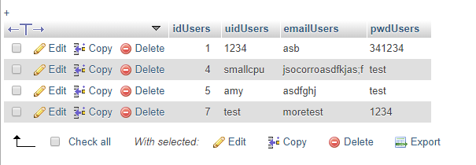

# Sprint-04 Written Report

## Team Number 13
- UI/UX Artifacts: Amairani López
- Infrastructure: Jorell Soccoro
- Developer: Jorell Socorro
- Junior Developer: Jared Mcvey
- Project Manager: Jared McVey

## UI/UX Artifacts

## Infrastructure
### Database of Users

### Database Structure

### Script Database Connect

### Script Logging out

### Script Insert to Database

### ADMIN PAGE AFTER LOGGED IN

## Developer
### Proof of developement

### Restart of html to php

### php scripts to react to database

### Header Nav html php

### Index.php main page

## Junior Developer

## Project Manager

### Boom Saver Goal:
- Give users that are tech illiterate awareness on the technology vulnerabilities around them and motivate them to stay informed through a point and blog system.

### Sprint 4 Goals:
- Home Page is hard coded with current news articles.
- FAQ / Contact Us page is integrated.
- Sign Up process is available.
- Blog System Hard Coded.

### Sprint 4 Goals:
- Blog system integrated on website and must have users to add blogs and comments
- Embed point system for users

1. Place images of the full User & Admin and/or anonymous story here with annotations of the functioning and the non-functioning portions as necessary (can reuse the artifact created by UI/UX)
2. List any detailed assumptions your team made explaining deliverable context as needed
- Issues with the database with other team members is the biggest challenge that I am trying to solve. Worked on the problem for about 3-8 hours with the guidance but had no progress to the point where another plan to share database information for the product is needed. Overall two tasks are left which are to post blogs and add comments to the blog
