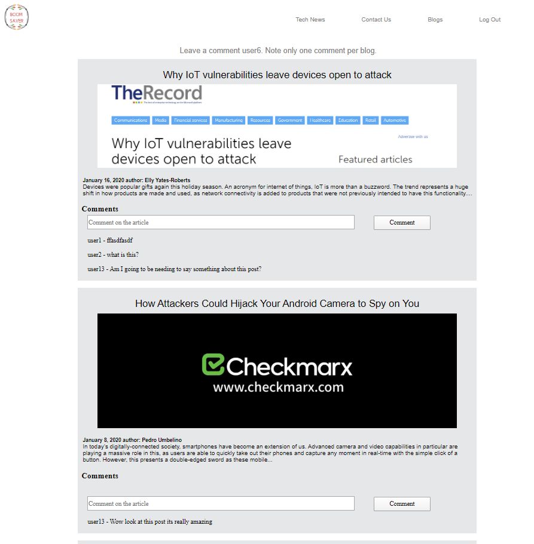

# Sprint-05 Written Report

## Team Number 13
* Jorell Socorro - Infrastructure/Developer/Junior Developer
* Amairani Lopez - UI/UX Infrastructure
* Jared McVey   - Project Manager

## UI/UX Artifacts
### Login/ Sign Up Restyling

#### https://github.com/illinoistech-itm/2020-team13w/commit/3cde618c1257252bf91bfbdb7eefadb08ea42fe1
  
  

### Cleaning up styling 

#### https://github.com/illinoistech-itm/2020-team13w/commit/cd464a9370190f0ee6cbb35b6d7a1848de257047
   
 

### Making the comment section and readjusting the blog

#### https://github.com/illinoistech-itm/2020-team13w/commit/a2eeb920e33dbdcae039ba1ae9240d0af2452490
  
    
 
### Added user interactivity and warnings 

#### https://github.com/illinoistech-itm/2020-team13w/commit/ea8435d9e562895b57fcb9ec56812edbb195c048
  
   
 
### Errors fixed from sprint 4
#### Images would scale too big on bigger screens, so "Read More" button would be chopped.
 
#### Sign in/ Sign up input boxes would be all over the place specially of bigger screens
  
#### Articles would become too small to read and comment box would go outside the page
  
#### Header would be transparent at high widths 
  
 
* Add screenshot of a minimum of 5 additional GitHub issues/bugs reported, assigned, and resolved

## Infrastructure
### Automation Database
* https://github.com/illinoistech-itm/2020-team13w/commit/ae7f67e1af617bf5f6762219e510b9a43581d5ad
* https://github.com/illinoistech-itm/2020-team13w/commit/0c97c47ae304a458bd78387d62bd307c1d2dec1e
* https://github.com/illinoistech-itm/2020-team13w/commit/2a0d4aef862f6aec57111d79b8774eb760615fac
  

### Automation VM
* VM automation was not created however database/table/admin user is all automatically made the moment a new user of the website jumps in. Later team members will be able to show the demostration on how this is going to work.

## Developer
### HTML to PHP
* https://github.com/illinoistech-itm/2020-team13w/commit/a21fff259e2b476b44f4d3dd298ae35847d68ac3

### Login System
* https://github.com/illinoistech-itm/2020-team13w/commit/a21fff259e2b476b44f4d3dd298ae35847d68ac3

### Comment System
* https://github.com/illinoistech-itm/2020-team13w/commit/990b82782b9203c11648b7ca6a3ac4f8a2b48fa1
* https://github.com/illinoistech-itm/2020-team13w/commit/990b82782b9203c11648b7ca6a3ac4f8a2b48fa1
* https://github.com/illinoistech-itm/2020-team13w/commit/4a20d02170124cf39a1ddfb9a17a87d885f28759
* https://github.com/illinoistech-itm/2020-team13w/commit/6b1da485202a077d290fa00348ff27606274fbf7
* https://github.com/illinoistech-itm/2020-team13w/commit/47efdf193ae05d9825b427f6c67788106ba3049d 
* https://github.com/illinoistech-itm/2020-team13w/commit/031d446a4a552b58b6a80bf0b41ddc2d55c525b0

#### Automation
        ## Acquiring GIT Project
        git clone https://github.com/illinoistech-itm/2020-team13w.git
        or
        if having issues with cloning due to access, deploy ssh key to avoid any problems
            - open powershell type: ssh-keygen
            - press "enter" twice 
            - next type: ls ~/.ssh to view files
            - next type: cat ~/.ssh.id_rsa.pub
            - copy from powershell the key
            - go to the git project you want to view and look at settings/deploy keys
            - click on add deploy key, give a title of machine accessing and paste key into key box
            - do not check box and press add key
            - go back to powershell and type git clone git@github.com:illinoistech-itm/2020-team13w
            - press enter and you should be good to go on acquiring the project

        ---Code---
        <?php

        $servername = "localhost";
        $dBUsername = "root";
        $dBPassword = "";//change this to your database info
        $dBName = "boomSaver";//change this to your database info
        $user = "admin";
        $pass = "root";

        //connection to our database
        $conn = mysqli_connect($servername, $dBUsername, $dBPassword, $dBName);

        if (!'conn') {
            die("Connection failed: ".mysqli_connect_error());
        }

        $sql = "CREATE TABLE usercom (
            idUsers INT(11) AUTO_INCREMENT PRIMARY KEY NOT NULL,
            uidUsers TINYTEXT NOT NULL,
            emailUsers TINYTEXT NOT NULL,
            pwdUsers TINYTEXT NOT NULL,
            comment1 VARCHAR(255) NOT NULL,
            comment2 VARCHAR(255) NOT NULL,
            comment3 VARCHAR(255) NOT NULL,
            comment4 VARCHAR(255) NOT NULL,
            comment5 VARCHAR(255) NOT NULL
            )";

        if ($conn->query($sql)) {
            echo "Table created successfully";
        } else {
            
        }

        //prepares the statement to look into table
        $stmt1 = $conn->prepare('SELECT uidUsers, pwdUsers FROM usercom WHERE uidUsers = ? OR pwdUsers = ?');
        $stmt1->bind_param('ss', $user, $pass);
        $stmt1->execute();
        $stmt1->store_result();

        //checks if admin was already created
        if ($stmt1->num_rows) {
        
        }
        //automatically creates an admin account
        else {
            echo "created";
            $admin = "INSERT INTO usercom (idUsers, uidUsers, emailUsers, pwdUsers, comment1, comment2, comment3, comment4, comment5)
            VALUES ('0', 'admin', 'admin@example.com', 'root', '', '', '','', '')";
            $conn->query($admin);
        }
        ---Code---

#### non-root creation

 - User is created to allow to leave a comment into the blog page, without an account you are not able to leave a comment.

## Junior Developer
 ### Admin
* https://github.com/illinoistech-itm/2020-team13w/commit/12be9b4f04fe61f08d78011b4282d5fcd87c698a
* https://github.com/illinoistech-itm/2020-team13w/commit/384729965b2284e0c2378a35486aba76f0ad8770
* https://github.com/illinoistech-itm/2020-team13w/commit/0ee1d2dafb15cd40ada368649d426b8be6a00017
* https://github.com/illinoistech-itm/2020-team13w/commit/cdee2a600bd42c57ceff4ccf8c26e7741c920cd5

#### Feature on obtaining user info
* https://github.com/illinoistech-itm/2020-team13w/commit/12be9b4f04fe61f08d78011b4282d5fcd87c698a

#### User Feature Experience
##### Comment Section Usage

##### Contact page responses

#### IP information

## Project Manager
* List any detailed assumptions your team made explaining deliverable context as needed
    * The automation for running on a VM was not possible due to the lack of practice in preparing it. However there will be a install.md file that will go through very simple steps on installing a program that is only needed to be able to start up the mysql server.
    * Xaamp is everything you need to run the program, it is very important to know that the user who has the program puts the folder of the project into the /xaamp/htdocs once the user types localhost/boomSaver it will do everything automatically
    * Some other assumptions that rose up was the UI/UX errors that appeared when trying to change the look of the program. Supposedly when a style is changed the look of the site should change, but that was not happening. It was causing us alot of trouble but we were able to prevail
    * The overall project was fun and exciting to work with, after the incident during the half way point we made sure to keep up the goal of the site and tried our best with our skill to have a usuable site that provides at least two functions for the user experience.
    * Backend was one of the most important parts and most difficult since without it there the entire site will not function as a normal site.
    * The website is created to let users be aware on what is going on in the world with technology vulnerbilities, during the search for any sites I learned alot on different scenerios of computer vulnerbilities.
    * We were not able to add the feature to add blogs from users, however even though code was created it was not implemented into the site. That was one of our goals we were not able to reach but it is alright.

